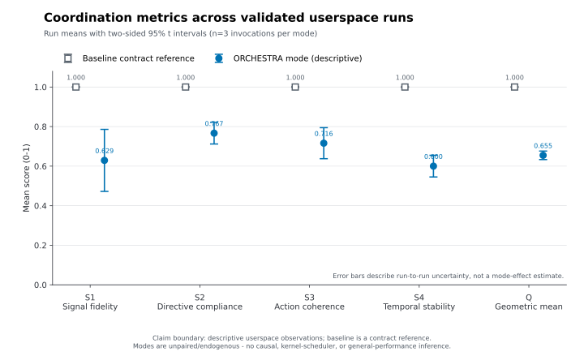
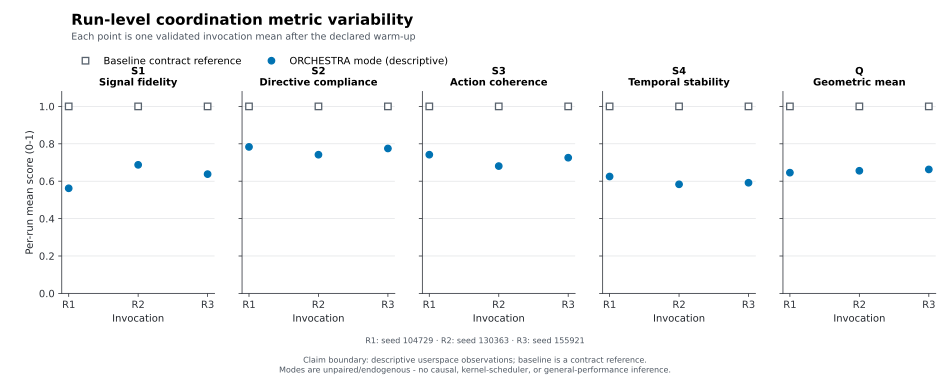
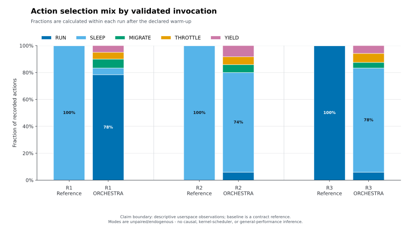

# Paper CPU userspace smoke v1 result — 2026-08-03

## Evidence status

This is a bounded **userspace-validated smoke result** for selected WP2-WP6 mechanics.
It is not an Experimentally validated scheduler result, a kernel prototype, a
causal baseline comparison, a hard-real-time result, or production-security
evidence.

The authoritative retained copy for this result is:

```text
artifacts/test-results/2026-08-03/benchmark/authoritative-c
```

It is a byte-identical copy of the original
`/tmp/orchestra-paper-cpu-smoke-v1-20260803-c` capture and contains all six raw
CSV files and stderr logs, per-run records, provenance, validation outcomes,
and processed summaries. The dated artifact index and `SHA256SUMS` preserve its
local identity. Approved long-term storage and retention policy are still
required for release evidence. The earlier `-a` and `-b` campaigns are retained
separately as superseded evidence and must not be mixed with this result.

## Frozen inputs and host

- Source SHA-256: `d5ec68c28a2cfcc20475dba44cb4b3c36b46b08acb4206647b874d2e2edf8713`
- Binary SHA-256: `f2f14020ef6f4caf7cc1f9dda3b392451367209b9d9f79e27415680c5e678b4b`
- Harness SHA-256: `3c07263066118a7f08c9e10ae80c488bb8fae680db08b31cba6b7154aec193d6`
- Manifest SHA-256: `40844535648f4a7dc25131141035d9cfb88886c20f0f8b9fb4bbbc8ffef02b5a`
- Metrics schema SHA-256: `04cb97e55d66bcf3e03e810372865c25368c89abb5de4e09e43d952d6f2d09c2`
- Captured at: `2026-08-02T19:33:41Z` (`2026-08-03` Asia/Kolkata)
- Host: Intel Core i5-10310U, 4 cores / 8 threads, approximately 32 GB RAM
- Kernel: Kali Linux `7.0.12+kali-amd64`, x86-64, bare metal
- Frequency policy: `powersave`; Intel turbo was enabled
- Privilege: non-root, no effective capabilities; real-time entry was disabled
- Repository state: not a Git worktree, so file hashes provide revision identity

The binary was rebuilt immediately before the campaign with the repository
Makefile (`cc -O2 -std=c11 -Wall -Wextra -Wpedantic -Werror ...`). The harness
records source and binary hashes but cannot independently prove their build
association; the command and matching pre/post hashes are the available local
provenance because this directory has no Git metadata.

The host was an active desktop rather than an isolated benchmark machine.
Background activity and the powersave policy are recorded in provenance and
limit interpretation.

## Protocol completion

The manifest ran four eligible workers, no real-time workers, one second of
calibration, four measured seconds, a 100 ms period, ten excluded warm-up
ticks, and three fixed seeds per mode. Baseline ran before ORCHESTRA for each
seed; modes never ran concurrently.

All six invocations:

- returned zero without timeout or interruption;
- produced exactly 40 rows, with 30 post-warm-up rows;
- exceeded the predeclared 4.5-second minimum wall duration;
- passed the strict 40-column schema and cross-field validation;
- preserved source and binary hashes throughout the campaign;
- reported zero publisher deadline misses and zero frame rejections; and
- produced two bounded controller updates per ORCHESTRA invocation.

The statistical unit is one invocation, so each mode has `n = 3`; tick rows
were not treated as independent observations.

## Descriptive results

The intervals below are untruncated two-sided 95% Student-t intervals over the
three invocation means.

| Mode | S1 mean [95% CI] | S2 mean [95% CI] | S3 mean [95% CI] | S4 mean [95% CI] | Q mean [95% CI] |
| --- | --- | --- | --- | --- | --- |
| Observed-state reference | 1.000 [1.000, 1.000] | 1.000 [1.000, 1.000] | 1.000 [1.000, 1.000] | 1.000 [1.000, 1.000] | 1.000 [1.000, 1.000] |
| ORCHESTRA | 0.629 [0.472, 0.786] | 0.767 [0.712, 0.821] | 0.716 [0.638, 0.794] | 0.600 [0.545, 0.655] | 0.655 [0.633, 0.676] |

## Visual summary



The reference values are contract checks and the modes are descriptive,
unpaired, and endogenous. The intervals describe run-to-run uncertainty; they
are not mode-effect intervals.





The plotting code, source-integrity hashes, deterministic-generation details,
and figure-specific interpretation boundaries are recorded in the
[figure manifest](figures/paper_cpu_smoke_v1_2026-08-03/README.md).

### What the charts prioritize

- `S4 = 0.600` is the lowest ORCHESTRA component mean. The matching bounded
  actuators are perceptual jitter and switching penalty, with migration bursts,
  latency, fairness, and responsiveness checked before accepting a change.
- `S1 = 0.629` has the widest interval. That calls for independent held-out
  predictor calibration, confidence validation, and freshness/cost measurement;
  it does not justify retuning the predictor from aggregate `Q`.
- `S3 = 0.716` supports evaluating bounded switching penalty and compatible
  policy consensus, while checking homogenization and correlated-failure risk.
- The action mix changes sharply across invocations. That reinforces the need
  for identical workload replay and counterbalanced order before comparing
  modes; it is not evidence of a treatment effect.

ORCHESTRA used the prediction for 95.6% of post-warm-up decisions on average;
low-confidence rows used observed CPU. The reference mode deterministically
selected the observed-state directive, which makes S2 perfect by construction.
Its stable unanimous actions also make S3 and S4 perfect, while its observed
signal reference normalizes S1. These values are a contract check, not evidence
that the reference is a superior scheduler.

The host signal was endogenous: one reference invocation selected RUN for most
post-warm-up actions and consumed much more userspace CPU than the other two
reference invocations. This is direct evidence that subtracting the mode means
would be confounded. No speedup, treatment effect, hypothesis test, or Linux
scheduler improvement is reported.

## Control decision

The implemented outer controller acts on the 20-tick schedule only when the
current acceptance snapshot is complete, and controls only population
mechanisms with a declared causal connection:

- deficient S4 increases perceptual jitter;
- deficient S3 or S4 increases the switching penalty;
- deficient S3 increases bounded Q-table consensus;
- healthy S3/S4 slowly decay the corresponding actuators; and
- actuator updates use `beta = 0.02 / sqrt(1 + step)` with fixed bounds.

The controller does not drive aggregate Q directly. It does not retune predictor
gain when S3 or S4 is deficient. S1/prediction deficiency instead causes
observed-state fallback; predictor or sampling changes require separate
held-out calibration and budget evidence. Rejected or incomplete frames remain
visible in coordination telemetry but cannot assign rewards or update the
controller/consensus path.

## Testing evidence and remaining gates

The associated test pass covered strict GCC/Clang warnings, GCC ASan/UBSan,
13 named C unit groups under both compilers, four benchmark-validator tests,
five bounded integration scenarios, rejected-frame controller gating, tamper
rejection, exact-zero Q, thundering-herd S4, reward dominance, signal teardown,
and GCC/Clang static analysis.

The next performance experiment still needs an isolated and pinned host,
counterbalanced or randomized mode order, an independently held-out calibration
trace, workload replay that is identical across modes, a power-analysis-based
repetition count, latency/fairness/energy measurements, and explicit
instrumentation overhead. Kernel dispatch, real-time precedence, multi-core or
NUMA hierarchy, key lifecycle, fault recovery, and long-duration reliability
remain upstream work-package gates.

Those dependencies, controller guardrails, benchmark levels, stop criteria,
rollback requirements, and the ordered next execution tranche are defined in
the [release-readiness plan](../operations/release-readiness-plan.md).
